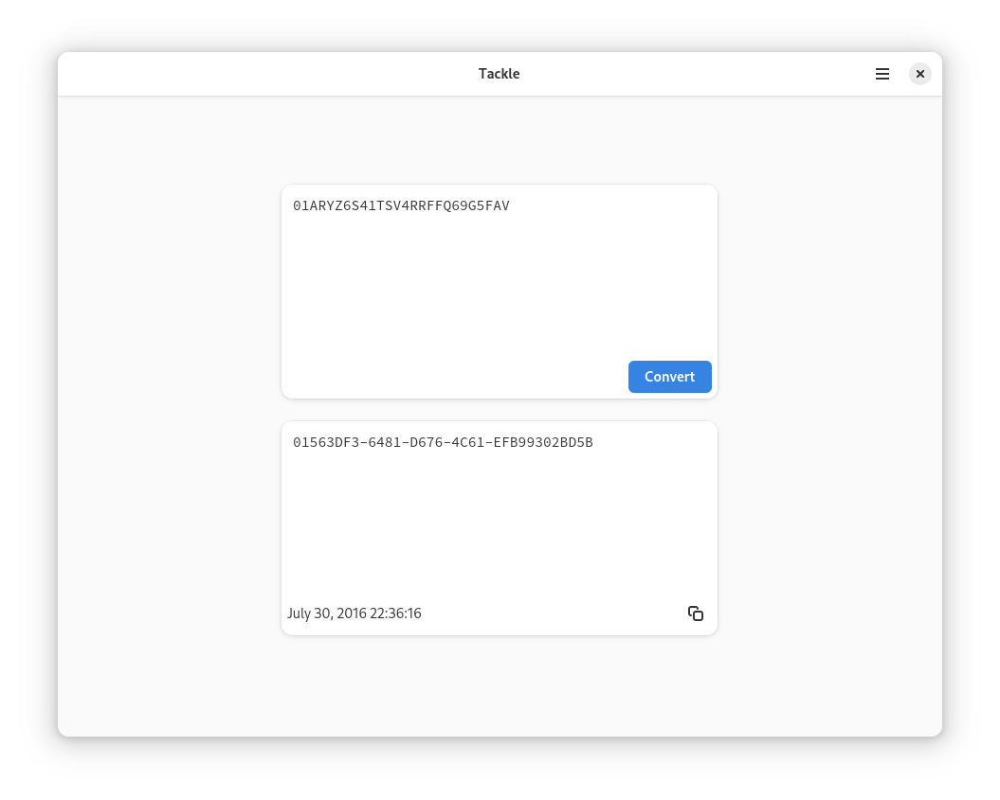

# Tackle

A small toolbox of personal utilities.



## Features

Currently _Tackle_ can convert a [ULID](https://github.com/ulid/spec) to a UUID and display the associated metadata.

## Building

This repo contains a [devcontainer](https://containers.dev/) configuration the comes with everything you need to build and run this application (i.e. zig, zls, gtk, libadwaita, etc...).

You can build & run the application with:

```sh
zig build run
```

## Testing

Tests require _libc_ for access to `<time.h>`:

```sh
zig test -lc src/ulid.zig
```
